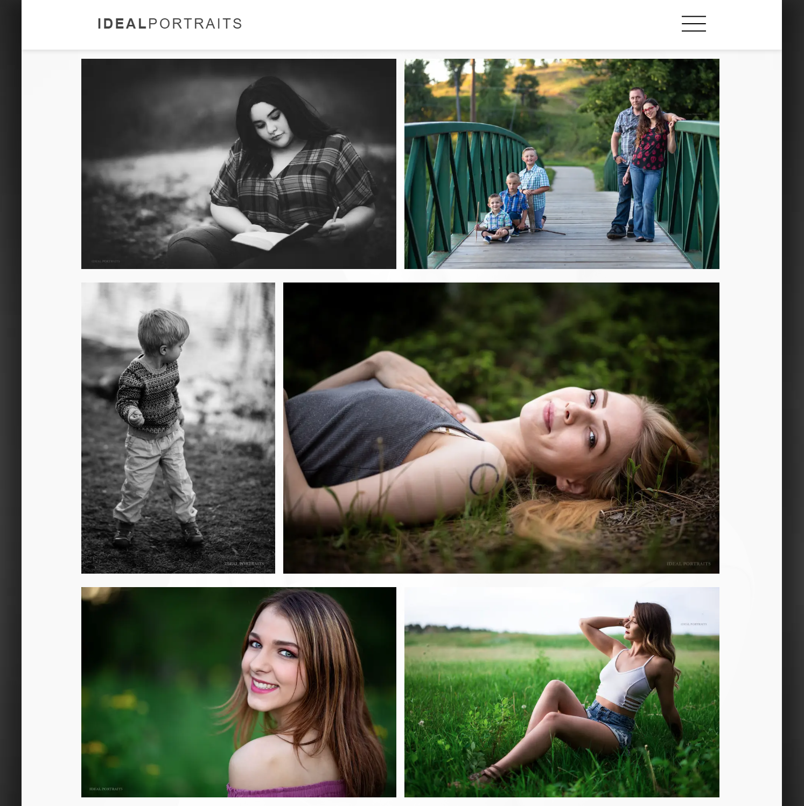
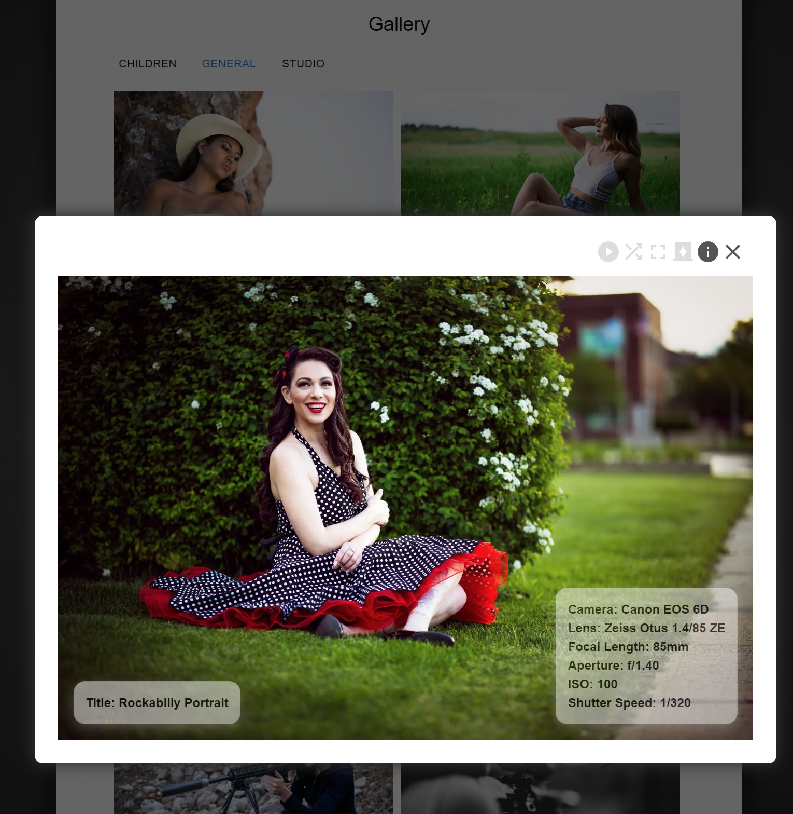
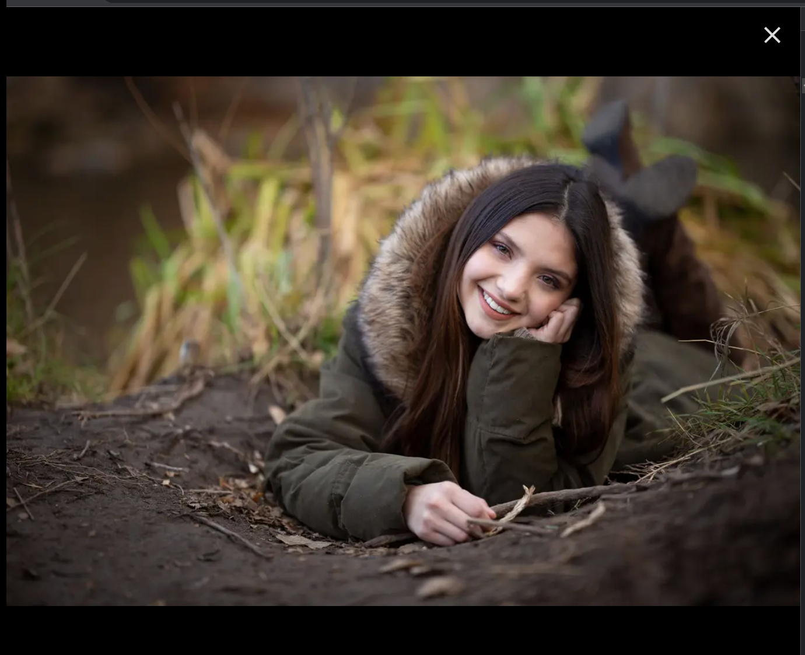

# NextJS Justified Gallery (njGallery)
***
## About


njGallery (Next.JS Justified Gallery) was designed to maintain image aspect ratio without cropping. It takes
as input an array of image URLs and sizes the images to fill the width of the container they've been placed in.

Images always maintain their original aspect ratios. This applies to the gallery, lightbox, and fullscreen mode. When the browser window is resized, the calculation re-runs in order to maintain justification.

Live demo: http://business.jerradjohnson.com/gallery

Examples:

### Gallery




### Lightbox



### Fullscreen Mode



## Features

The lightbox offers autoplay, shuffle, a dark background mode, and optional tooltip display.

Autoplay or shuffle continue if enabled when fullscreen mode is chosen.

Keypresses (right and left arrows, escape) will change to the next or previous image, or close the lightbox or fullscreen mode.

## Usage

### Import
Import njGallery, and import the CSS (or create your own styles), e.g.

```
import {NjGallery} from 'njGallery'
import "njgallery/styles/lightbox.css";
```

### Setup

Set remote image access in `next.js.config`, e.g.

```
module.exports = {
  reactStrictMode: true,
    images: {
        domains: ['raw.githubusercontent.com'],
    },
}
```

### Sample Gallery input and call

```
const photoArray = [
    {
        blurSrc: "https://raw.githubusercontent.com/Jerrad-Johnson/njgallery-with-lightbox/main/shared_images/tiny/Shared.jpg",
        src: "https://raw.githubusercontent.com/Jerrad-Johnson/njgallery-with-lightbox/main/shared_images/sm/Shared.jpg",
        lg_img_url: "https://raw.githubusercontent.com/Jerrad-Johnson/njgallery-with-lightbox/main/shared_images/lg/Shared.jpg",
        height: 450,
        width: 300,
        alt: "Parrot",
        tooltip_left: tooltips_left[0],
        tooltip_right: tooltips_right[0],
    },
];
    

const galleryInputs = {
    images: photoArray,
}
```

```
<NjGallery
   { ...galleryInputs }
/>
```

### Requirements

Every image must include `src` (url), `height`, `width`, and `alt`. Height and width must be provided as whole numbers representing pixel measurements, e.g. `300`.

If you're dynamically generating a list, pass an empty array of images `[]` until the data is loaded. Example: `const galleryInputs = { images: [] }`

`blurSrc` is not required, but highly recommended.

***

## Options

Default values will be used if you set none of these values. **You may skip this section.**

### List
Unless otherwise stated, any number examples must be a whole number, e.g. `20` and will be interpreted as a pixel value.

`containerWidth` Defines the width of your gallery's container. The value can be any valid CSS. Example: `200px`, `50%`. Default: `100%`

`containerPadding` Defines the padding of your gallery's container, and more padding leaves less room for images. Default: `10`.

`imagePadding` Defines the padding **between** images. You can set `horizontal`, `vertical`, or both. Default: `{vertical: 10, horizontal: 10}`.

`targetRowHeight` Although image height will vary, the algorithm will attempt to keep them at or close to this value. Default: `300`.

`showIncompleteRows` Determines whether images will be hidden if they do not complete a row. For example, if you have six images, and four fit on a single row, and the last two cannot be sized to fill the next row, then they will be omitted entirely. Must be boolean. Default: `true`.

`targetRowHeightTolerance` Decimals are allowed, and the range is from `0` to `1`. At `0`, as long as the container is large enough, no vertical resizing will occur. All images will be at their target height, and no justification will occur. This value **will** often distort images, and is not recommended. Default: `.2`

`maxRows` Limits the number of rows of images your gallery will display; beyond this, images will be hidden. Example: `3`. Default: `Number.POSITIVE_INFINITY`.


Lightbox tooltips can be added to your images, and any valid JSX should render. Example:
```
const tooltips_left = [
    (
        <ul>
            <li>Title: Reptile Gardens Parrot</li>
        </ul>
    ),
];
const tooltips_right = [
    (
        <ul>
            <li>Camera Model</li>
            <li>Lens Model</li>
        </ul>
    ),
];

const photoArray = [
    {
        blurSrc: "https://raw.githubusercontent.com/Jerrad-Johnson/njgallery-with-lightbox/main/shared_images/tiny/Shared.jpg",
        src: "https://raw.githubusercontent.com/Jerrad-Johnson/njgallery-with-lightbox/main/shared_images/sm/Shared.jpg",
        lg_img_url: "https://raw.githubusercontent.com/Jerrad-Johnson/njgallery-with-lightbox/main/shared_images/lg/Shared.jpg",
        height: 450,
        width: 300,
        alt: "Parrot",
        tooltip_left: tooltips_left[0],
        tooltip_right: tooltips_right[0],
    },
]
```

You may apply a custom style to the MUI buttons. Example:

```
const lightboxMuiButtonsTheme = {
    palette: {
        primary: {
            main: '#555555',
            contrastText: '#000',
        },
        secondary: {
            main: '#dddddd',
            contrastText: '#fff',
        },
    },
};

const lightboxFullscreenMuiCloseButtonTheme = {
    palette: {
        primary: {
            main: '#dddddd',
            contrastText: '#fff',
        },
    }
}

const galleryInputs = {
    images: photoArray,
    lightboxMuiButtonTheme: lightboxMuiButtonsTheme,
    lightboxFullscreenMuiCloseButtonTheme: lightboxFullscreenMuiCloseButtonTheme,
}
```


### Sample with options, and custom MUI theming:
```
const galleryInputs = {
    images: photoArray, 
    containerWidth: "100%",
    containerPadding: 10,
    imagePadding: {vertical: 10, horizontal: 10},
    targetRowHeight: 300,
    showIncompleteRows: false,
    targetRowHeightTolerance: .2,
    maxRows: 1,
    lightboxMuiButtonTheme: lightboxMuiButtonsTheme,
    lightboxFullscreenMuiCloseButtonTheme: lightboxFullscreenMuiCloseButtonTheme,
}

```

# Known Bugs

## Minor

Scrollbars appear upon window resize if in fullscreen mode. This slightly hides the close button.

# Notes
Project required `npx @next/codemod next-image-to-legacy-image`

# Credits
NextJS Justified Gallery uses a **slightly** modified justified-layout script by SmugMug.

Their license is included `credits/LICENSE`